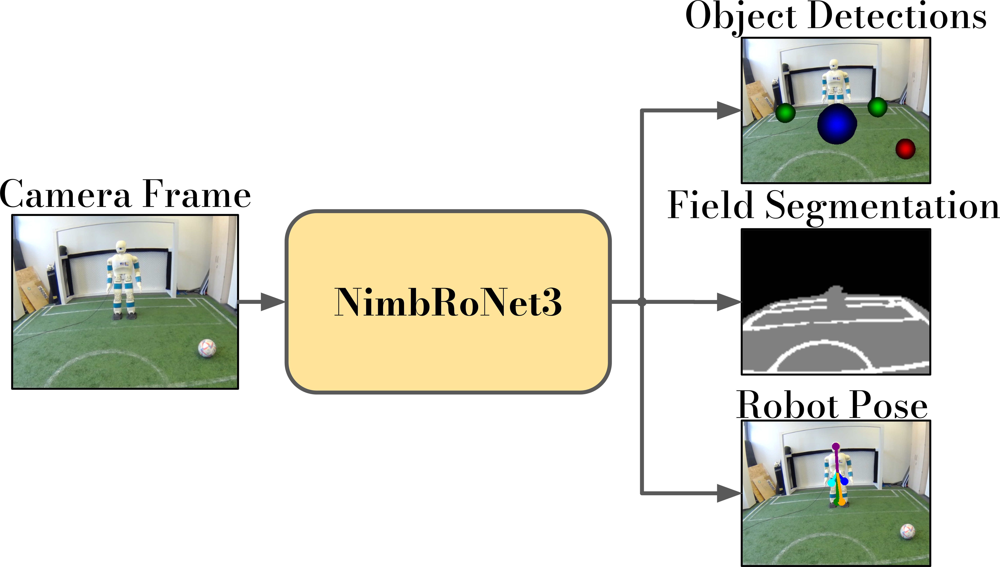
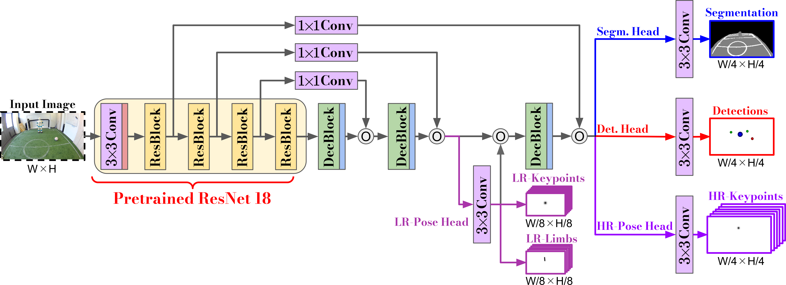
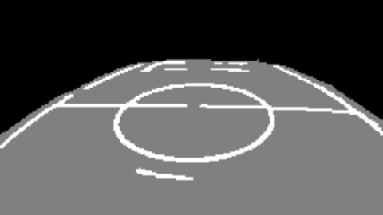

# NimbRoNet3: A Unified Model for Real-Time Perception on the Soccer-Field


Official implementation of:  **NimbRoNet3: A Unified Model for Real-Time Perception on the Soccer-Field**, presented at the RoboCup 2023 Humanoid Adult-Size league Software Challenge. [[Poster](http://www.angelvillarcorrales.com/templates/others/Publications/2024_RoboCup_NimbroNetv3_Poster)] [[Paper](https://arxiv.org/abs/2401.05909)]


<p float="left">
  
  &nbsp;&nbsp; &nbsp;
  
</p>

<p float="left">
  
  
  
  
</p>


## Installation

We refer to [resources/docs/installation.md](https://github.com/angelvillar96/NimbRoNet3/tree/master/resources/docs/installation.md) for detailed installation and preparation instructions.


## Training

We refer to [resources/docs/training.md](https://github.com/angelvillar96/NimbRoNet3/tree/master/resources/docs/training.md) for detailed intructions on how to train and evaluate a model.


## Sources

For further information about our NimbRoNet models and our system, we refer to our previous publications:


 - Pavlichenko et al. "RoboCup 2022 AdultSize Winner NimbRo: Upgraded Perception, Capture Steps Gait and Phase-based In-walk Kicks" RoboCup 2022: Robot World Cup XXV. 2023

 - Amini et al. "Real-time pose estimation from images for multiple humanoid robots." Proceedings of 24th RoboCup International Symposium, June 2021.
 
 - Rodriguez et al. "RoboCup 2019 AdultSize Winner NimbRo: Deep Learning Perception, In-Walk Kick, Push Recovery, and Team Play Capabilities" RoboCup 2019: Robot World Cup XXIII. 2019


## Contact and Citation

This repository is maintained by [Angel Villar-Corrales](http://angelvillarcorrales.com/templates/home.php).

Please consider citing our paper if you find our work or our repository helpful.

```
@incollection{NimbRoWinnerRoboCup2023,
	title={{RoboCup 2023 Humanoid AdultSize Winner NimbRo: NimbRoNet3 Visual Perception and Responsive Gait with Waveform In-walk Kicks}},
	author={Pavlichenko, Dmytro and Ficht, Grzegorz and Villar-Corrales, Angel and Denninger, Luis and Brocker, Julia and Sinen, Tim and Schreiber, Michael and Behnke, Sven},
	booktitle={RoboCup 2023: Robot World Cup XXVI},
	pages={},
	year={2024},
	publisher={Springer}
}
```

In case of any questions or problems regarding the project or repository, do not hesitate to contact the authors at villar@ais.uni-bonn.de.

