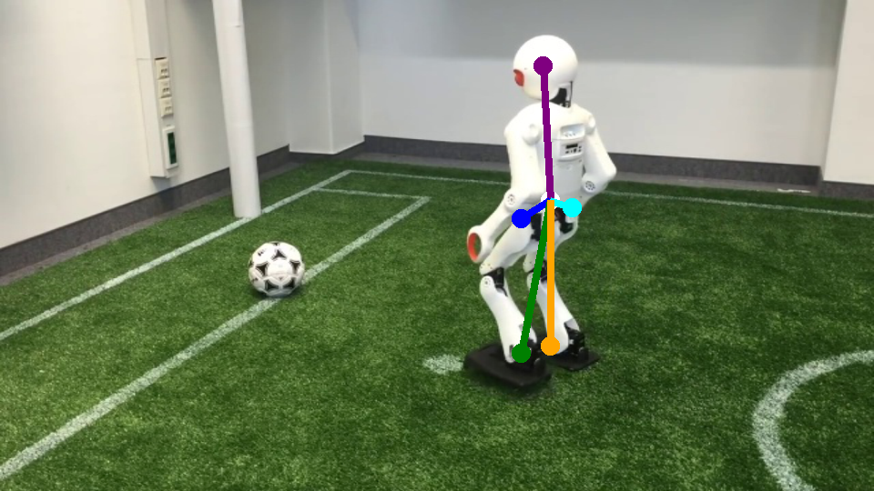

# Installation and Data Preparation

## Installation

1. Clone and enter the repository:
```
git clone git@github.com:angelvillar96/NimbRoNet3.git
cd NimbRoNet3
```

2. Install all required packages by installing the ```conda``` environment file included in the repository:
```
conda env create -f environment.yml
conda activate NimbRoNet3
```


## Dataset Preparation

Our NimbRoNet3 requires 3 different datasets to use its complete functionality:


### Detection Dataset

Our models detect 3 different classes: ball, goal-post, obstacle.
The detection dataset containes pairs of images with detection labels.
These labels correspond to the center of the ball, center-bottom of goal-posts, and center-bottom of obstacles, where Gaussian blobs
will be centered as in the examples below.

Labels can be given in XML format as in the following [example](https://github.com/angelvillar96/NimbRoNet3/blob/master/resources/docs/_example_xml.xml)


### Segmentation Dataset

Our models segment the image into three different classes: background, soccer field, and line.
You can see example of segmentation maps below.


### Pose Estimation Dataset

For robot pose estimation, we use our prevously publised dataset from:

 - Amini et al. "Real-time pose estimation from images for multiple humanoid robots." Robot World Cup. Cham: Springer International Publishing, 2021. 91-102.


You can find more details and download the data in the [official repository](https://github.com/AIS-Bonn/HumanoidRobotPoseEstimation/tree/main).


<p float="left">
    
    
    
    
</p>

<p float="left">
    
    
    
    
</p>

